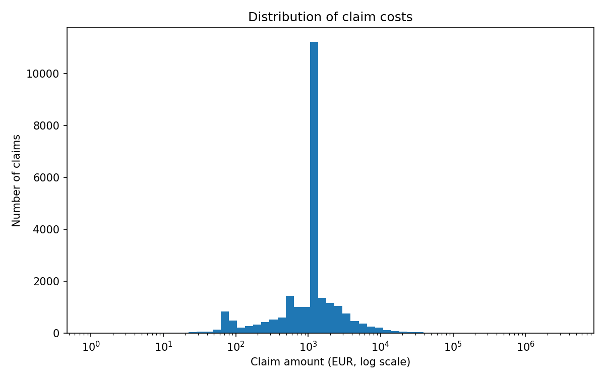
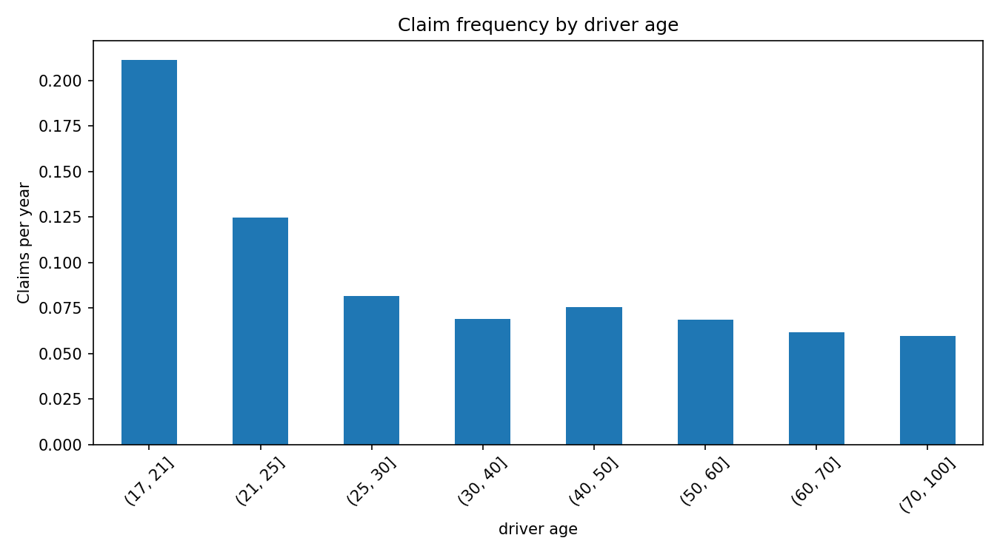
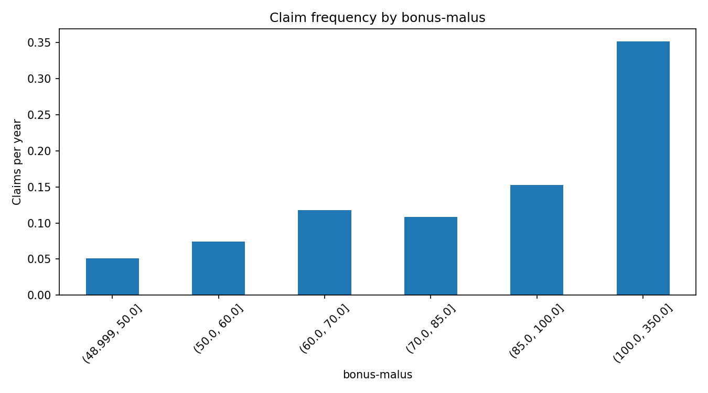
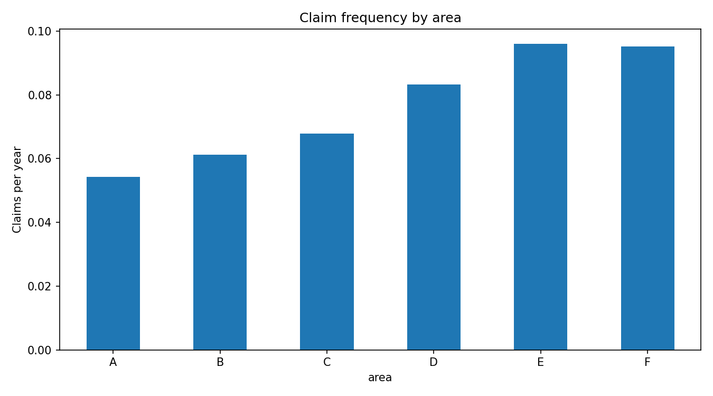

# Motor Insurance Pricing Model

A frequency–severity pricing model for motor third-party liability insurance,
built in Python on the French MTPL dataset (`freMTPL2`, ~678,000 real policies).

The model estimates how often each policy is expected to claim and how much each
claim is expected to cost, combines the two into an expected annual claims cost,
loads that into a chargeable premium, and stress-tests the result against the
assumptions it depends on.

---

## Running it

```bash
pip install pandas numpy scikit-learn matplotlib
python3 pricing_model.py
```

The dataset is `freMTPL2freq` joined to `freMTPL2sev`, available from OpenML
([41214](https://www.openml.org/d/41214) and
[41215](https://www.openml.org/d/41215)). Place the joined file at
`data/fremtpl2.csv`.

---

## Method

**Frequency — Poisson GLM with a log link.** The target is claims per year of
exposure, with each policy weighted by its exposure. This is equivalent to
including `log(Exposure)` as an offset, which is the standard treatment: a
policy held for three months has had a quarter of the opportunity to claim as
one held for a full year, and ignoring that makes short policies look
artificially safe.

**Severity — Gamma GLM with a log link.** Fitted only on policies that produced
a claim (around 3.68% of the book), with average cost per claim as the target and
claim count as the weight. Claim amounts are strictly positive and right-skewed
with variance that grows with the mean, which is what the Gamma family is for;
ordinary least squares would assume constant variance and can predict a negative
claim cost.

**Pure premium** is the product of the two:

```
pure premium = expected frequency × expected severity
```

**Office premium** loads that for expenses, capital and profit:

```
premium = (pure premium × (1 + risk margin) + fixed expense)
          ÷ (1 − variable expense rate − profit rate)
```

The division matters. Commission, premium tax and profit are percentages of the
premium itself, so they cannot simply be added to the claims cost — the formula
has to resolve that circularity.

---

## Banding

Continuous rating factors are banded before modelling, because their
relationships with claim frequency are not straight lines. The boundaries were
chosen from the exploratory analysis rather than by an automatic rule:

```python
AGE_BANDS = [17, 21, 25, 30, 40, 50, 60, 70, 100]
```

Narrow where the signal is concentrated (18–25), wide where the relationship is
flat (50+). This matters more than it looks — see the third finding below.

---

## Findings

- Frequency 0.0737 per year, policies claiming 3.68%
- Under-21s 0.2114, over-70s 0.0597 → 3.5× spread
- Bonus-malus 0.0513 to 0.5677 → 11× spread
- Area 0.0543 (A) to 0.0960 (E), with F at 0.0953 — plateau confirmed
- Median claim €1,172 vs mean €2,269, largest €4,075,401
- Average premium €248, range €99 to €2,196

## Claim amounts

FINDING: Right-skewed as expected — most claims are around €1,000–2,000, with 
a long tail reaching €4M. This supports using a Gamma model rather than 
linear regression.

CAVEAT: There is a large spike at around €1,200, with roughly 11,000 claims 
compared with around 1,200 in nearby bins. This could be a standard settlement 
or placeholder value rather than a natural pattern, and could bias the severity
model towards this amount.

## Driver age

FINDING: Falls steeply from 0.21 for under-21s to 0.06 for over-70s, a 3.5x 
difference. Most of the change happens in the first two age bands, with rates
staying fairly flat after age 35.

There is no increase at older ages, unlike typical UK motor data. This could 
be because MTPL only covers third-party damage, so accidents involving older 
drivers may often result in damage to their own vehicle instead.

## Bonus Malus

FINDING: This is the strongest factor in the dataset, ranging from 0.05 to 0.57
— an 11x difference.

There is a sharp jump at 100 (0.15 to 0.34). This seems to separate drivers 
earning a discount from those who have actually made a claim. However, this 
is partly circular because the score itself is based on claim history.

The small dip between 70 and 85 breaks the overall upward trend and is 
likely just noise.

## Area 

FINDING: Rises steadily from area A to E, going from 0.054 to 0.096 — a 1.8x 
difference. More urban areas likely have more junctions, 
parked cars and pedestrians.

The rate levels off at E/F (0.0958 vs 0.0952), so the relationship is not 
completely linear. This supports treating area as categories rather 
than fitting a straight-line relationship.

---

## Problems encountered

Five results were initially wrong or surprising. The investigations were more
informative than the fixes.

### Bonus-malus could not be split into equal-population bands

`pd.qcut` failed with `ValueError: Bin edges must be unique`, returning six
identical boundaries at 50.0.

The error was the finding: over half the portfolio sits at exactly bonus-malus
50, the maximum no-claims discount, and a single repeated value cannot be
divided across bands. Resolved by using explicit boundaries, isolating the 50
group and splitting the remainder where drivers are genuinely spread out.

### A likely standardised settlement amount in the claims data

The first severity histogram rendered as a single bar. `bins=60` produced sixty
equal-width bins in euros; with a maximum claim near €4m each bin spanned
roughly €67,000, so almost every claim fell into the first. A logarithmic x-axis
did not help because the bins themselves were still equal-width. Resolved by
generating logarithmically spaced bin edges with `np.logspace`.

The corrected chart revealed a data-quality issue: a single bin near €1,200
holds roughly 11,000 claims against ~1,200 in each neighbour. No natural
distribution produces an eightfold spike in one bin, so this is most likely a
standardised settlement figure or a placeholder for unfinalised claims. It would
bias a severity model toward that value, and is a genuine limitation of fitting
on this dataset.

### Automatic banding destroyed the young-driver signal

The univariate chart showed under-21s claiming 3.5× as often as the oldest
group, but the fitted GLM gave the youngest age band a relativity of 0.88 —
implying 12% *fewer* claims. Both could not describe the same population.

Inspecting the fitted discretiser's `bin_edges_` showed band 0 spanning ages
18 to 28, more than twice the width of any other band. The cause was
`strategy="quantile"`, which sizes bands to hold equal *numbers* of drivers;
young drivers are a small share of the portfolio, so the lowest band had to
reach to 28 to gather a tenth of the book, averaging the 0.21 frequency of
18–21s together with the much lower rates of 22–28s.

Switching to `strategy="uniform"` did not help — it produced bands of ~8 years
each, several of them nearly empty at the top of the age range, with band 0
still spanning 18–26.

Neither automatic strategy places a boundary at 21, because neither knows what
the exploratory analysis found. Resolved by banding on explicit boundaries
derived from the data. This is a concrete argument for why pricing actuaries
band by judgement rather than algorithm.

A secondary effect is also present and worth separating from the banding issue:
the exploratory charts are univariate while the GLM is multivariate, estimating
each factor holding the others constant. Young drivers cluster at high
bonus-malus scores, so once the model accounts for bonus-malus, some of the risk
that age was standing proxy for is correctly reattributed.


### A non-monotonic lift table caused by five large claims

The lift table showed band 1 — the decile the model priced cheapest — with an
actual cost of EUR 148 per policy-year against a predicted EUR 65, making it the
second most expensive band in reality. That would suggest the model was failing
to rank risk at the cheap end.

Mean exposure was checked first, on the theory that very short policies produce
inflated per-year costs when they do claim. That was ruled out: band 1 averaged
0.533 years of exposure, in line with bands 2 to 6.

The actual cause was the severity tail. Band 1 contained 365 claims totalling
EUR 1.39m, of which five claims accounted for 54.8% — the largest being
EUR 382,955. Excluding those five brings the band's actual cost to roughly
EUR 67 against a predicted EUR 65.

The model was ranking risk correctly; a handful of catastrophic liability claims
landed in the cheapest decile by chance. This is the standard argument for
capping large losses and pricing them through a separate excess layer rather
than letting them distort the ground-up model.


### Unresolved: test balance

Balance on training data is 1.0002, as expected for a GLM with a log link.
On the holdout it is 0.929, meaning the model under-predicts total claims by
around 7%. Roughly 2% is explained by the random split (observed frequency is
0.0734 in train against 0.0747 in test); the remainder is not diagnosed.
Merging the sparse bonus-malus bands did not close it.
---

### Sparse bands produced an unreliable relativity

The fitted model gave bonus-malus 100–125 a relativity of 3.55 while 125–150
came out at 1.20 and 150–350 did not appear in the top twenty at all, despite
the raw data showing frequency climbing to 0.5677 in that top band.

Counting policies per band explained it: 6,987 in 100–125 but only 598 and 209
in the two bands above. Regularisation correctly pulled coefficients estimated
on 209 rows toward 1.0. Merging the three into a single 100+ band gave 7,794
policies and a relativity of 3.87, restoring a clean monotonic ladder across the
factor. This also matches the structure in the data, where crossing the neutral
point at 100 matters more than the gradations above it.

## Validation

Validated on a 25% holdout split off before any fitting.

- **Balance** — predicted against actual total claims cost. A GLM with a log
  link should reproduce the observed total almost exactly on training data.
- **Actual vs expected by factor** — observed and predicted frequency compared
  across each rating factor's levels. This shows *where* a model is wrong, not
  just that it is.
- **Lift table** — the holdout is ranked by predicted pure premium and split
  into ten bands. If the model separates risk, actual claims cost rises across
  the bands. This answers the underwriter's real question in a way a single
  goodness-of-fit statistic does not.

Note that R² is near zero for this kind of model, and that is expected rather
than a failure. Predicting whether one specific driver will crash next year is
not possible; predicting the average cost of a *group* is, and that is all
pricing requires.


## Sensitivity analysis

Premiums are only as good as their assumptions, so the book is re-priced under
stressed scenarios. Severity is stressed harder than frequency because it is the
more volatile of the two — it absorbs claims inflation as repair costs and
injury settlements climb, while accident rates move slowly. The relative sizes
are a judgement rather than a measurement, as are the expense, profit and
risk-margin assumptions, which are illustrative rather than derived from the
data.


## CV summary

> Built a motor insurance pricing model in Python using ~678,000 real policy
> records. Modelled claim frequency and severity separately using Poisson and
> Gamma GLMs, handling policy exposure via an offset, and combined them into
> expected claims costs before loading for expenses, capital and profit to
> produce indicative premiums. Validated on a holdout sample using
> actual-versus-expected analysis and lift tables, and stress-tested the pricing
> against claims inflation and frequency assumptions.
