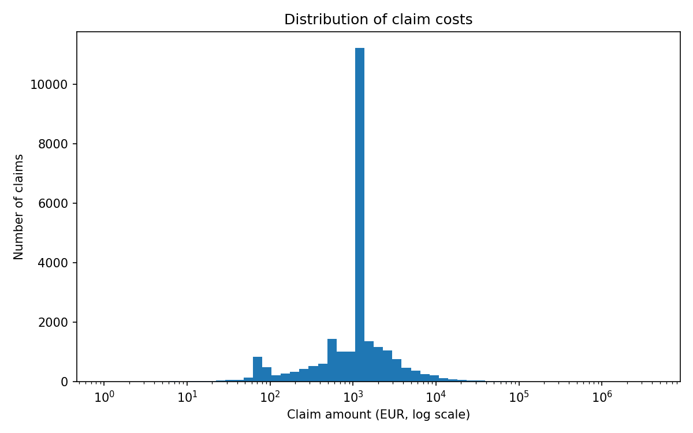
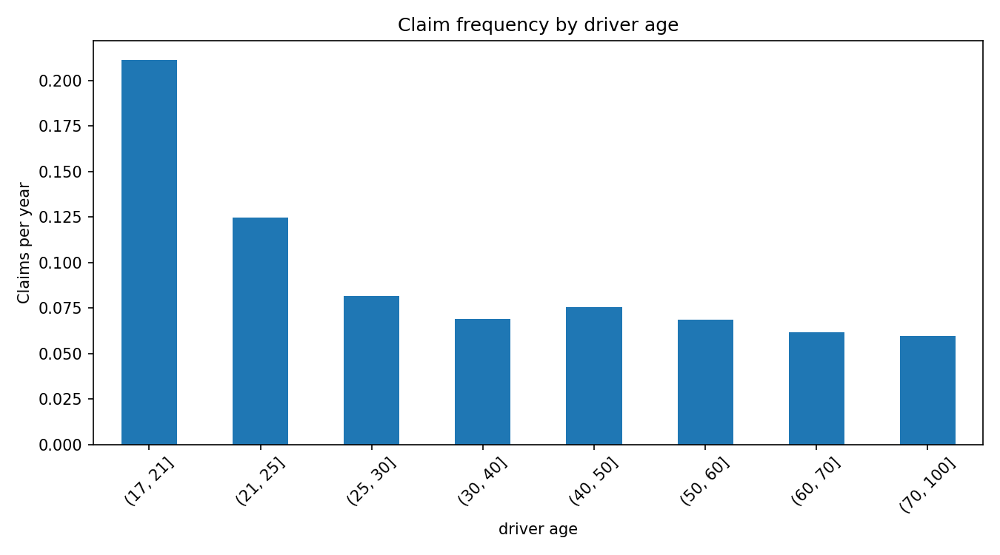
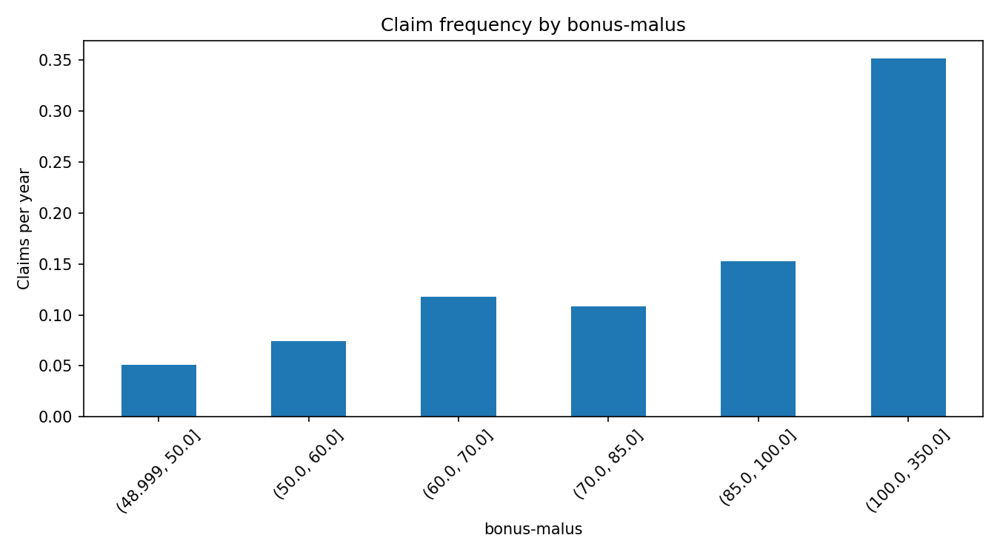
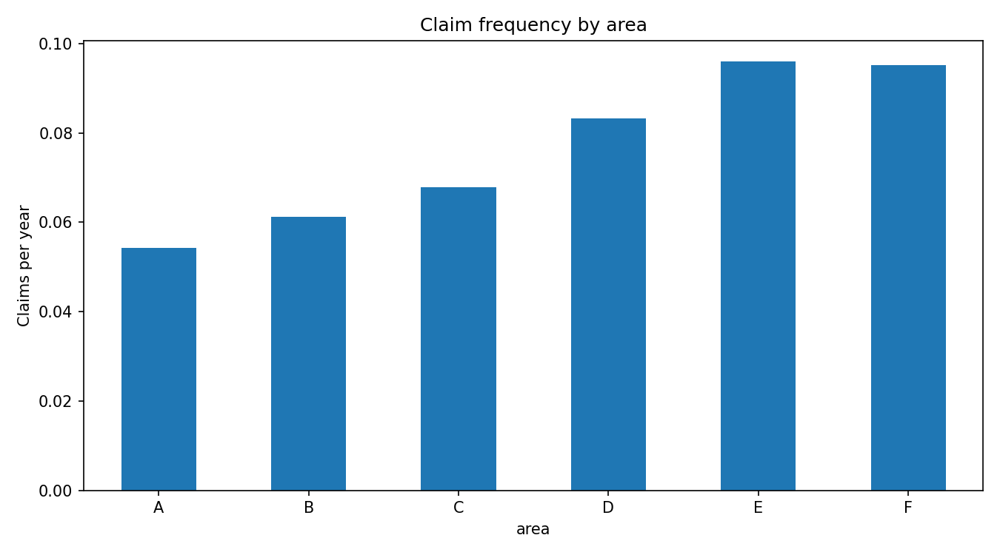

# Motor Insurance Pricing Model

A frequency-severity pricing model for motor third-party liability insurance, written in Python on the French MTPL dataset (`freMTPL2`, about 678,000 real policies).

It predicts how often each policy will claim and how much each claim will cost, multiplies the two to get an expected annual claims cost, turns that into a premium, and then stress tests the assumptions.

## Running it

```bash
pip install pandas numpy scikit-learn matplotlib
python3 pricing_model.py
```

The dataset is `freMTPL2freq` joined to `freMTPL2sev`, both on OpenML ([41214](https://www.openml.org/d/41214) and [41215](https://www.openml.org/d/41215)). Put the joined file at `data/fremtpl2.csv`.

## Method

**Frequency.** Poisson GLM, log link. The target is claims per year of exposure, and each policy is weighted by its exposure. That's the same as using `log(Exposure)` as an offset. A policy held for three months only had a quarter of a year to claim, so if you ignore exposure, short policies look safer than they are.

**Severity.** Gamma GLM, log link. Fitted only on policies with a claim (3.68% of the book). The target is average cost per claim, weighted by claim count. Claim amounts are always positive, right-skewed, and the variance grows with the mean. Gamma handles all of that. OLS assumes constant variance and can predict a negative claim cost.

Pure premium is frequency times severity:

```
pure premium = expected frequency × expected severity
```

The office premium adds expenses, capital and profit:

```
premium = (pure premium × (1 + risk margin) + fixed expense)
          ÷ (1 − variable expense rate − profit rate)
```

You divide instead of adding because commission, premium tax and profit are percentages of the final premium. Adding them to the claims cost would undercount them.

## Banding

I banded the continuous factors before modelling because their effect on claim frequency isn't a straight line. I set the boundaries by hand from the exploratory charts:

```python
AGE_BANDS = [17, 21, 25, 30, 40, 50, 60, 70, 100]
```

Narrow bands where the signal is (18–25), wide ones where it's flat (50+). The automatic options wiped out the young-driver effect. See Problems below.

## What the data shows

Overall frequency is 0.0737 claims per policy year. 3.68% of policies have at least one claim.



**Claim amounts.** Right-skewed, as expected. Most claims are €1,000–2,000, with a tail out to €4M. So Gamma, not OLS. There's also a big spike at €1,200 (see Problems).



**Driver age.** Frequency drops from 0.21 for under-21s to 0.06 for over-70s, a 3.5× difference. Most of the drop happens in the first two bands, and it's fairly flat after 35. Unlike UK motor data, there's no rise at older ages. MTPL only covers third-party damage, so older drivers' accidents may end up as damage to their own car instead.



**Bonus-malus.** The strongest factor: 0.05 to 0.57, an 11× difference. There's a sharp jump at 100 (0.15 to 0.34), which is where drivers go from earning a discount to being penalised for past claims. That's partly circular, since the score is built from claim history. The small dip between 70 and 85 is noise.



**Area.** Rises from 0.054 in A to 0.096 in E, a 1.8× difference. Urban areas have more junctions, parked cars and pedestrians. E and F are almost the same (0.0958 vs 0.0952), so I kept area as categories instead of fitting a straight line.

## Problems

Five results came out wrong or odd on the first run. Here's what caused each one.

### qcut couldn't band bonus-malus

`pd.qcut` failed with `ValueError: Bin edges must be unique` and returned six boundaries, all at 50.0. Over half the portfolio sits at exactly 50, the maximum no-claims discount, so qcut couldn't split it. I set the boundaries by hand: 50 on its own, then splits where the rest of the drivers are spread out.

### A spike at €1,200 in the claims data

The first severity histogram was a single bar. `bins=60` makes sixty equal-width bins, and with a max claim near €4M each one was about €67,000 wide, so nearly every claim landed in the first. A log x-axis didn't fix it because the bins were still equal-width. Log-spaced bin edges from `np.logspace` did.

The fixed chart showed one bin near €1,200 with about 11,000 claims, against about 1,200 in each neighbour. That's an eightfold spike. It's probably a fixed settlement amount or a placeholder for open claims. Either way it'll pull the severity model toward €1,200, and I can't fix that with this dataset.

### Automatic banding hid the young-driver effect

The chart showed under-21s claiming 3.5× as often as the oldest drivers. The GLM gave the youngest band a relativity of 0.88, so 12% fewer claims. Those can't both be right.

I checked the discretiser's `bin_edges_`. Band 0 ran from 18 to 28, more than twice as wide as any other band. `strategy="quantile"` makes each band hold the same number of drivers, and young drivers are a small part of the book, so the first band had to stretch to 28 to fill up. That averaged the 0.21 frequency of 18–21s in with the much lower rates of 22–28s.

`strategy="uniform"` didn't help either. It made bands about 8 years wide, several of them almost empty at the top end, and band 0 still went from 18 to 26.

Neither strategy puts a cut at 21, because neither one knows it matters. So I set the bands by hand.

There's a second thing going on too. The charts are univariate. The GLM isn't. Young drivers cluster at high bonus-malus, so once the model controls for bonus-malus, some of the age effect moves over to it.

### The lift table was out of order

Band 1, the decile the model priced cheapest, had an actual cost of €148 per policy year against €65 predicted. That made it the second most expensive band in reality.

I checked mean exposure first, in case short policies were inflating per-year costs. They weren't. Band 1 averaged 0.533 years, in line with bands 2 to 6.

A few huge claims caused it. Band 1 had 365 claims totalling €1.39M, and five of them made up 54.8% of that, the biggest at €382,955. Without those five, the band's actual cost drops to about €67 against €65 predicted. The model was ranking risk fine. Five big liability claims just happened to land in the cheapest decile. Insurers usually cap losses like these and price them in a separate excess layer, so they don't throw off the main model.

### Sparse bonus-malus bands

The model gave bonus-malus 100–125 a relativity of 3.55, 125–150 got 1.20, and 150–350 didn't make the top twenty at all, even though raw frequency climbs to 0.5677 in that top band.

The three bands had 6,987, 598 and 209 policies. Regularisation pulled the coefficients for the small bands toward 1.0. I merged all three into one 100+ band (7,794 policies). It got a relativity of 3.87, and the factor goes up steadily again. That fits the data anyway: crossing 100 matters more than anything above it.

## Open issue: holdout balance

Balance on the training data is 1.0002, which you'd expect from a log-link GLM. On the holdout it's 0.929, so the model under-predicts total claims by about 7%. About 2% comes from the random split (observed frequency is 0.0734 in train and 0.0747 in test). I haven't found the cause of the rest yet. Merging the sparse bonus-malus bands didn't close it.

## Validation

I held out 25% of the data before fitting anything.

* **Balance.** Predicted vs actual total claims cost. On training data a log-link GLM should match the total almost exactly.
* **Actual vs expected by factor.** Observed and predicted frequency across each level of each rating factor, to see where the model is off.
* **Lift table.** The holdout is sorted by predicted pure premium and cut into ten bands. If the model separates risk, actual cost goes up across the bands. That's what an underwriter wants to see, and one goodness-of-fit number won't show it.

R² is close to zero for this kind of model, and that's normal. You can't predict whether one driver crashes next year. You can predict the average cost of a group, and that's all pricing needs.

## Sensitivity analysis

I re-priced the book under stressed scenarios. Severity gets a bigger stress than frequency because it moves more: claims inflation pushes up repair and injury costs, while accident rates change slowly. The stress sizes are my own judgement. The expense, profit and risk margin figures are placeholders, not taken from the data.
